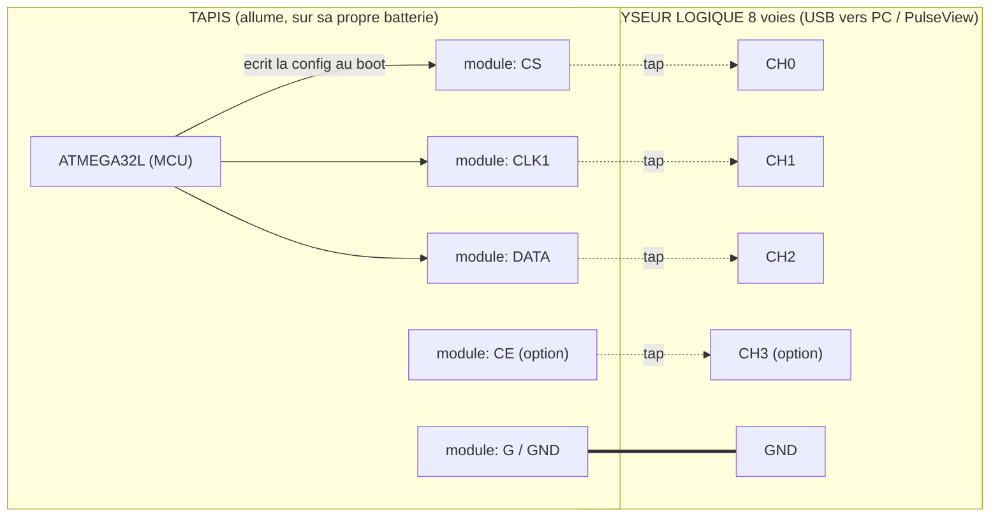

# Câblage de l'analyseur logique — sniff du mot de config nRF2401

But : lire les **5 paramètres ShockBurst** que l'**ATMEGA32L** écrit dans le **nRF2401** au boot, en
**espionnant passivement** 3 fils du module **TRW-24G** (interface de config 3 fils : **CS / CLK1 / DATA**).
Tap **lecture seule**, **aucune soudure**, sur un **tapis de spare** allumé.

## Schéma (qui se branche où)



> Les flèches pleines = le **MCU pilote** ces lignes (sens réel des signaux). Les liens pointillés
> « tap » = l'analyseur **écoute** la même ligne, **sans rien injecter**. Le trait épais = **masse commune**.

## Où piquer — connecteur du module (face pads, DuoCeiver)

Brochage relevé (voir `releve-rf.md` + photo `module-trw24g-face-pads.jpeg`) :

```
        Module TRW-24G  (face pads / DuoCeiver, rev. 1141 V2.01)
        +-------------------------------------------------------+
        |   colonne 1                 colonne 2                 |
        |                                                       |
        |   DATA  [o] ---> CH2         CLK1 [o] ---> CH1        |
        |   DR1   [o]                  CS   [o] ---> CH0        |
        |   DOUT2 [o]                  CLK2 [o]                 |
        |   DR2   [o]                  CE   [o] ---> CH3 (option)|
        |   VCC   [o]                  G    [o] ---> GND analyseur|
        +-------------------------------------------------------+
```

## Table de connexion

| Analyseur | Broche module | Rôle dans la capture |
|---|---|---|
| **CH0** | **CS** | Chip Select — **délimite** la trame de config (le passage à l'état HAUT = début du mot de config) |
| **CH1** | **CLK1** | Horloge — cadence **chaque bit** |
| **CH2** | **DATA** | Données — les **bits** du mot de config (~15 octets, MSB d'abord) |
| **CH3** *(option)* | **CE** | Chip Enable — distingue config / TX-RX (utile mais pas obligatoire) |
| **GND** | **G** | **Masse commune — OBLIGATOIRE** |

## Règles à respecter

- **Lecture seule** : on clipe sur les broches existantes (grabbers fins / micro-pinces), **on ne soude
  pas**, **on ne relie aucune sortie** de l'analyseur sur ces lignes.
- **Masse commune obligatoire** : GND analyseur ↔ G module, sinon mesures aberrantes.
- **Le tapis s'alimente seul** (sa batterie). L'analyseur **n'alimente pas** le module — il ne fait qu'écouter.
- **Ordre** : lancer la **capture d'abord**, **puis allumer le tapis** → ne pas rater le mot de config au boot.
- **Niveau logique ~3 V** (le nRF2401 est en ~3,3 V max) — vérifier au multimètre ; les analyseurs
  `fx2lafw` 8 voies lisent du 3,3 V sans souci. Échantillonner à **≥ 4×** la fréquence de CLK1
  (ex. CLK ~1–2 MHz → capturer à 8–24 MHz).

## Décodage (PulseView / sigrok)

- Décodeur **SPI** : CLK = **CLK1**, MOSI = **DATA**, CS = **CS**.
- ⚠️ Sur le nRF2401, **CS est actif à l'état HAUT** (config mode) — régler la **polarité CS** du décodeur
  en conséquence.
- Lire les octets de la rafale → les mapper sur les **registres de config nRF2401** :
  **canal (`RF_CH`) · débit (`RF_DR`) · adresse (largeur + valeur) · longueur payload · CRC**.
- Ces 5 valeurs → à recopier dans le firmware **ESP32 + nRF24L01+** (voir `../docs/transceiver-rf.md`).

---

## Relevé réel + procédure (2026-07-01) — analyseur `fx2lafw`, module sur embase

### Analyseur utilisé
- Clone **8 voies 24 MHz FX2 / `fx2lafw`** (USB **0925:3881**), étiqueté **CH1…CH8** (⚠️ **pas de CH0**).
- Pilote **WinUSB** (Zadig). Logiciels **PulseView 0.4.2** + **sigrok-cli 0.7.2** (portables, `yannis\tools`).
- ⚠️ **Un seul** logiciel à la fois sur l'analyseur (fermer PulseView avant sigrok-cli).

### Brochage réel du connecteur (2×5) — repère = l'ANTENNE
```
        ▲ CÔTÉ ANTENNE  (nos signaux principaux ici)
   CLK1 ───── DATA      (CLK1 et DATA face à face)
   CS         DR1       (CS juste sous CLK1)
   CLK2       DOUT2
   CE         DR2
   G          VCC ⛔    (bas, côté marquage « 1141, V2.01 »)
        ▼
```

### Câblage réalisé (SOUDÉ, sans pince) + voies
| Signal | Soudé sur | Voie (étiquette carte) | Canal logiciel |
|---|---|---|---|
| CS   | plot CS   | **CH3** | à confirmer (D?) |
| CLK1 | plot CLK1 | **CH2** | à confirmer (D?) |
| DATA | plot DATA | **CH1** | à confirmer (D?) |
| CE   | *(à souder ensuite)* | CH4 | — |
| masse | **« – » batterie** (fil noir) / plot G / boîtier blindé | **GND** | — |

> ⚠️ CHx (carte) ≠ Dx (logiciel). La correspondance **se déduit à la capture** : on enregistre les 8 voies
> et on regarde lesquelles bougent.

### Procédure sigrok-cli (piloté sans GUI)
1. **Détecter** : `sigrok-cli --scan` → doit lister `fx2lafw … 8 channels`.
2. **Repérer l'activité** (taper HAUT **en continu pendant** la commande) :
   `sigrok-cli -d fx2lafw --config samplerate=4m --samples 16000000 -O vcd -o cap.vcd`
   → compter les transitions par voie (voie horloge = beaucoup de changements).
3. **Mot de config au boot** : capture lancée **avant d'allumer** le tapis (ou déclenchement sur front),
   puis décoder : `sigrok-cli -i cap.vcd -P spi:clk=<CLK1>:mosi=<DATA>:cs=<CS>:cs_polarity=active-high -A spi`.
4. **Payload TX** : capturer pendant un appui (CE haut) → adresse + bitmask flèches.

### Deux pièges rencontrés (2026-07-01)
- **Timing** : la capture ne dure que quelques secondes → **générer le signal (taper) pile pendant**.
- **Enfoncement** : fils soudés sur les **plots du module** → si module pas bien **enfoncé dans l'embase**,
  plots **isolés du MCU** (rien à capter). Test : continuité **plot G ↔ « – » batterie** = doit **bipper**.
